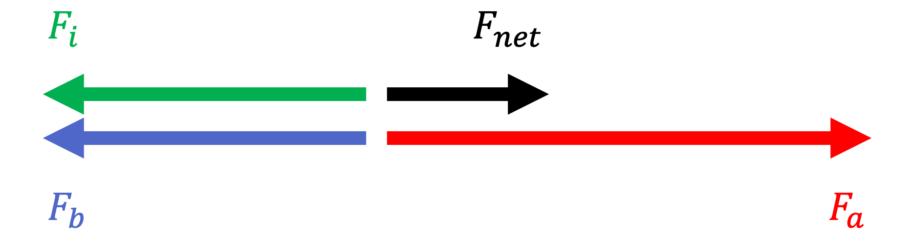
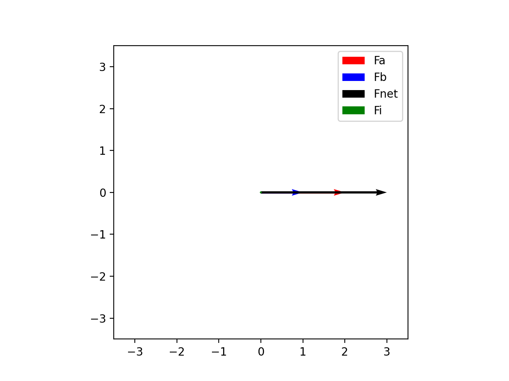
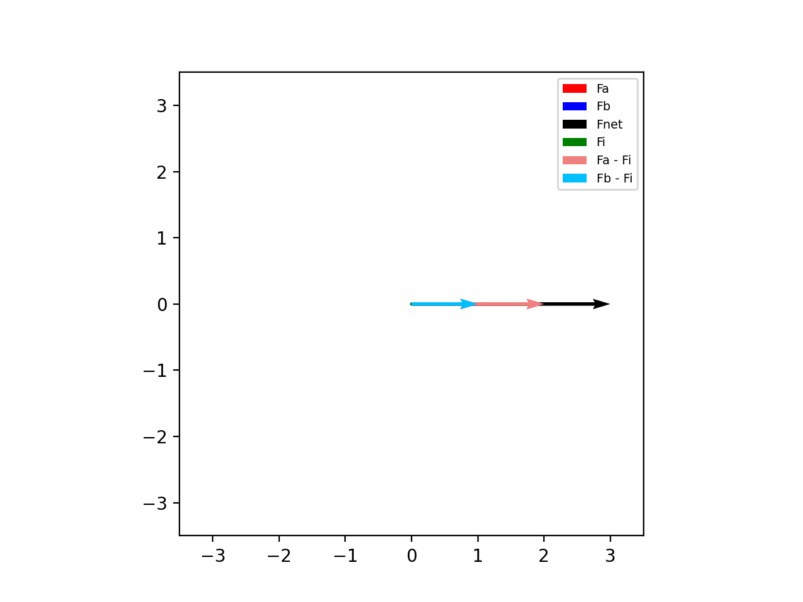
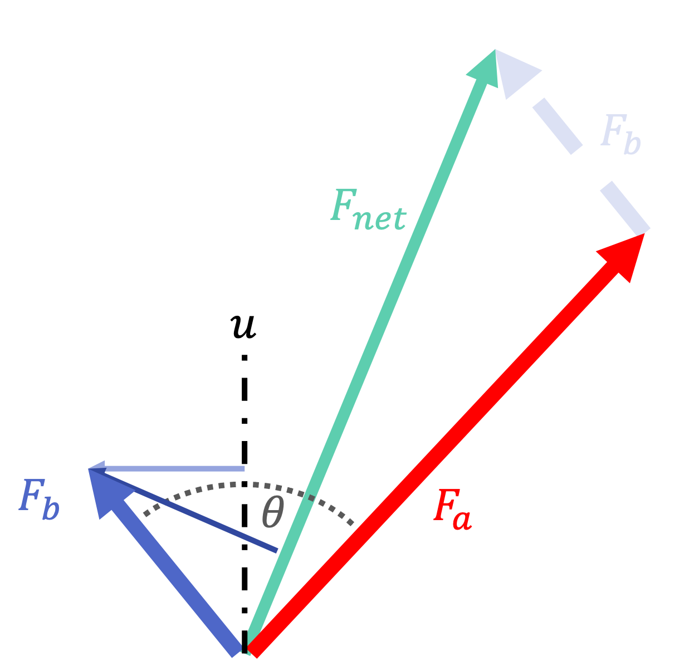
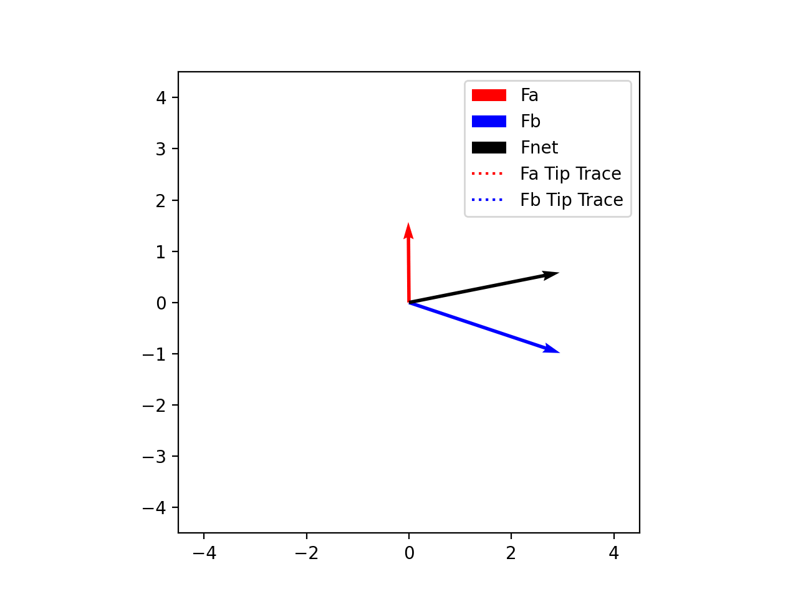
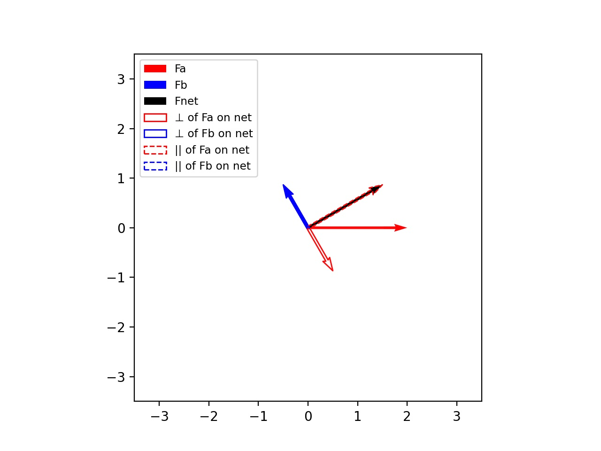
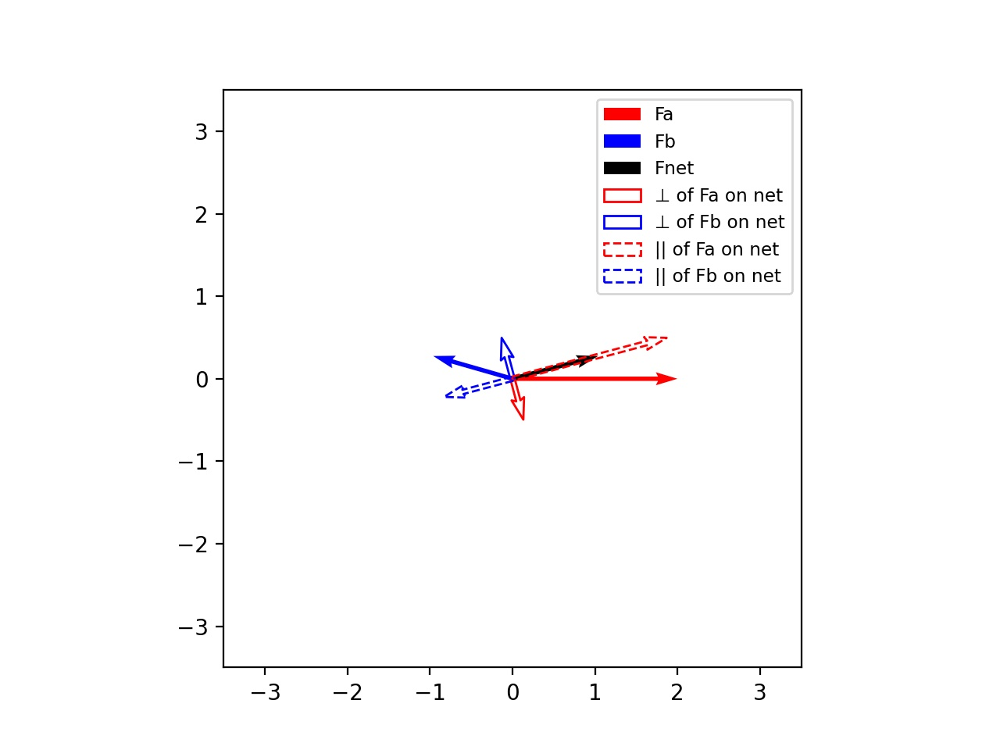
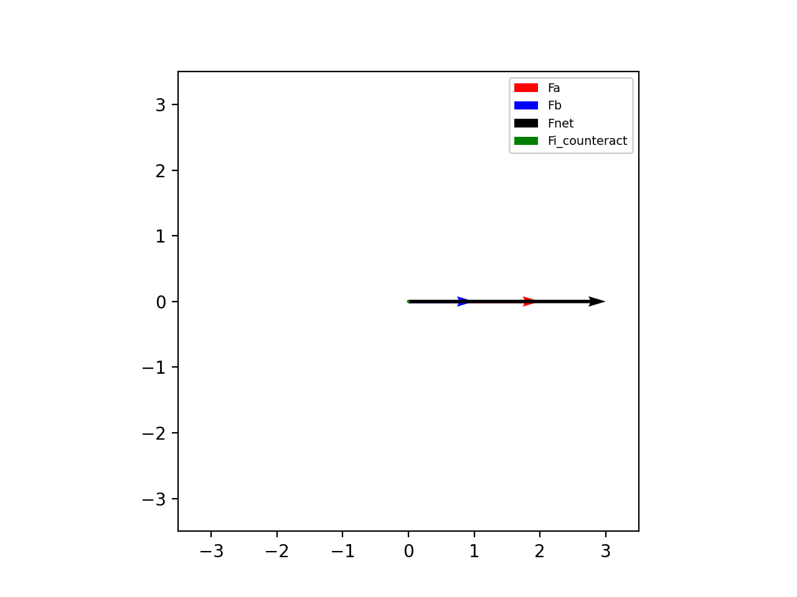
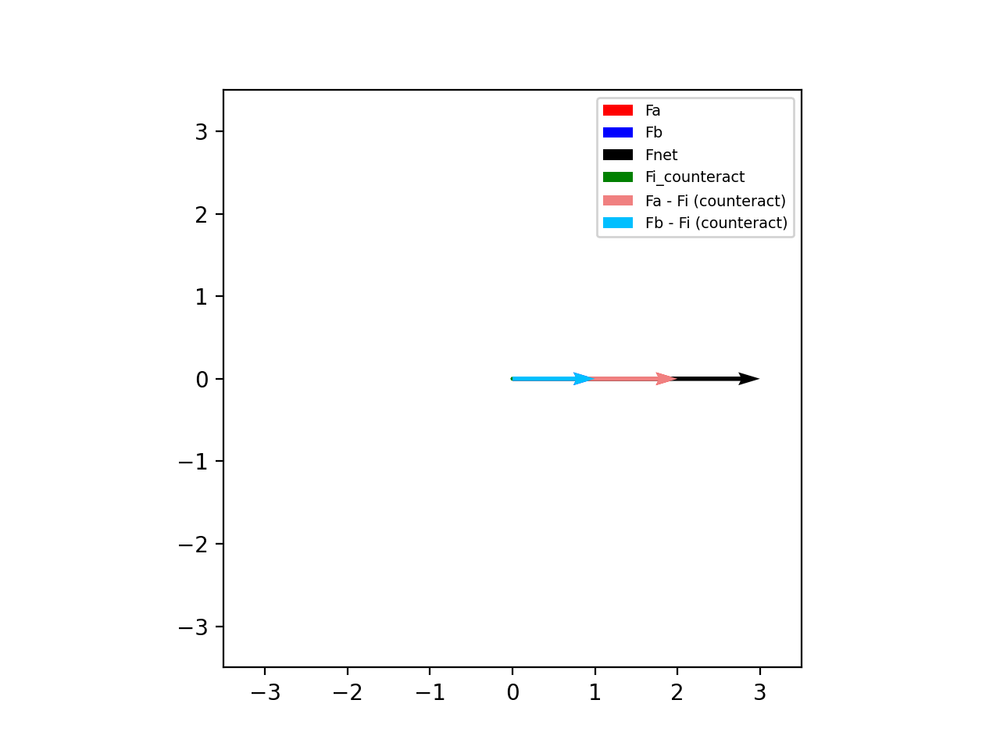

# Musings on Interaction Force
I've always found that some of my best thinking is done by writing things out until they make sense. So, in this document, my goal is to write and write about various interaction forces I see until the right approach/theory/equation falls out of it.

## What is Interaction Force?
When teams of agents---be them robotic or human---carry objects together, there is this idea of interaction force that arises. The force has often been described as 'the wasted force' or 'the force that does no work'. Imagine two individuals push on the same object with the same force. The object wouldn't move and the force that cancels out would be called the interaction force. Diving deeper, if both agents push on the object with 5N of force, the interaction force would be 5N.

The idea of interaction force has been brought up a decent amount in the literature of co-manipulation tasks. Some have theorized that the interaction force is something that we try to minimize as much as possible. Others have theorized that the interaction force serves a purpose as a channel for haptic communication. Others stipulate that it may be important, but only as a form of stabilization. It has been shown that when dancing, experts tend to increase their interaction force when compared to novices. 

The challenge becomes: how do we formally define interaction force? It would seem that, with so many opinions about it we would already have the common ground defined as for what interaction force is or how to calculate it. Surprisingly, while everyone seems to have a good intuition of what it is and what it entails, there actually lacks a good general definition.

## Groten's Definition
The clearest definition of interaction force we could find was that of Groten. In their paper, they define the interaction force as the lesser of two opposing forces. This definition is simple, easy to define, and matches intuition for a simple 1 DOF scenario with two agents. It can be seen below.

However, since Groten's definition only works for two agents and the 1 DOF scenario, it becomes difficult to use interaction force as a meaningful metric, or even to study its impact in human-human co-manipulation tasks without a broader definition.

To that end, we are hoping to expand the definition of interaction force to include the following characteristics:
- 6 degrees of freedom
- n- number of agents
- has an appropriate accounting for gravity
- deals with both forces and torques

## Expanding our Knowledge of Interaction Force
We began by searching out how to expand Groten's definition into a planar 2DOF environment. How does the interaction force change as Force B goes from being fully aligned with Force A to completely opposing it? We realized that, whatever the final solution, it should still match with Groten's definition in the 1DOF case: when the two forces are aligned the interaction force should be nonexistant, and when the forces are opposing, the interaction force should give the smaller of the two forces.

### Bisection Angle
Recognizing this, we first explored a simple mapping that would give us those results:
$$F_I=\min(F_a,F_b) \sin(\theta/2)$$
where $\theta$ is the angle between the two force vectors. This worked great when talking about magnitudes but, in terms of vector math, broke down as it only scaled the smaller of the two vectors by $\sin(\theta/2)$. Expanding this further, we adjusted this concept for vector math as:
$$F_I=\perp\mathrm{proj}_{u}\min(||F_a||,||F_b||)$$

In other words, we find the force with the smallest magnitude, then find the component of that force that is perpendicular to the line that bisects the two force vectors. Below is an example:

#### Issues
Initially, it looked great. However, as we began looking into it, we started to have issues with the definition. If interaction force is the measure of wasted force, it would follow that the interaction force does not contribute to the net force. In other words, if we were to subtract the interaction force from $F_a$ and $F_b$, we would think the forces should be aligned with the net force. However, trying to do so left us with the following.

This was problematic. If we subtract the interaction force from the two forces, why would it be possible to calculate an interaction force from both resulting force vectors (i.e., one could compute the bisection angle between the light red and light blue vectors and use the same equation to calculate an interaction force which doesn't make sense). In other words, this couldn't be the full definition of interaction force as some interaction was clearly still there.

### Net Force
We then began considering the same approach but with respect to the net force as opposed to the bisecting angle:
$$F_I=\perp\mathrm{proj}_{F_{net}}\min(||F_a||,||F_b||)$$

However, this clearly yielded its own problems as it didn't match Groten's 1D defintion.

Chaos ensued. Coordinate frames were drawn and redrawn. Vectors were split into their components along all axis and added and subtracted from one another. Some vyed for a theory based around the bisection angle, others the net force. Alliances shifted and flowed like sand across the desert waste. 

Through it all, a few new theories began to emerge.

#### Convergence on a Solution
Revisiting the concept of interaction force, both Dr. Salmon and Shaden separately concluded that any component that is not strictly "in the direction" of the net force (from the perspective of the net force) should consist of the interaction force. This would mean that, when the lesser of the two forces is within 90 degrees of the net force, the interaction force would consist of the orthogonal component (the parallel component would be in agreement with the net force). At and past 90 degrees, the parallel component would no longer align with the net force, and so it too would add to the net force. As such, the interaction force would be the orthogoal component of the smaller vector up to 90 degrees of the net force, then the full force vector past 90 degrees with the net force.

Another way to consider this is that if Agent A removed the interaction force from their own force and Agent B did the same, the resultant net force should not change (see above). If we had a scenario wherein Agent B pulls completely perpendicular to the net force, they in no way contribute to the net force. Sure, the net force wouldn't be in the same place if not for $F_b$, but geometrically, no component of $F_b$ acts along $F_{net}$. All of the force of Agent B is considered interaction. If we remove the interaction force from both partners, the net force would remain the same and would be equal to Agent A's 'useful' force. This can be seen in the image below. $F_b$ is completely orthogonal to $F_{net}$ and is therefore entirely an interaction force. If we remove the equal and opposite force from $F_a$, we see that $F_b - F_i$ matches the $F_{net}$.

As we move past the 90 degree mark, we can see that, if we subtract the equal and opposite component of $F_b$ that is orthogonal to $F_{net}$, from $F_a$ (i.e., $F_i - \perp\mathrm{proj}_{F_{net}}F_b$), we are left with the parallel component of $F_a$ on $F_{net}$. However, this component is too long and exceeds the net force. As previously described, when we remove the interaction force from all agents, we should be left with the same net force. So, in this scenario, by subtracting the orthogonal component of $F_b$, we are left with the dotted red and blue lines below (another interaction force). We quickly can see that by subtracting the parallel component of $F_b$ from the parallel component of $F_a$, we are given the net force. In other words, $F_b$ is the entirety of the interaction force.

Now, if this situation holds true, the interaction force should looks something like this:

When we consider the previous issue with the bisection method (wherein each force subtracted by the interaction force left you with forces that could, in and of themselves, have an interaction force with each other), this method (I'll call "counteraction") performs much more intuitively:

